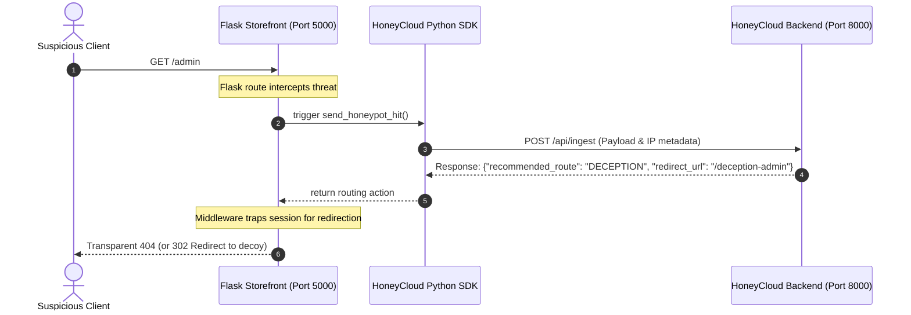

# Demo E-Commerce Storefront with HoneyCloud Integration 🛒🛡️

A professional Flask-based storefront demonstration showcasing how enterprise-grade production applications integrate with the HoneyCloud Active Deception and SIEM/SOAR threat monitoring platform.

---

## 🎯 Purpose & Learning Goals

This project serves as a practical template for technical interviews and cybersecurity architecture showcases. It illustrates:
1. **API-Key Event Ingestion**: How backend services securely register with HoneyCloud to transmit events.
2. **Active Redirection Middleware**: How standard applications dynamically check connection routing decisions to transparently divert suspicious actors into isolated honeypots.
3. **Telemetry Logs Auditing**: Automated recording of high-fidelity signals such as failed logins, credential brute forcing, and username enumeration.
4. **Honeypot Decoy Sensors**: Designing custom decoy routes (`/admin`, `/.env`, etc.) that mask themselves under standard errors (404/403) while quietly logging target IP addresses.

---

## ⚙️ Core Architecture & Flow



---

## 📂 Project Structure

- **`app.py`**: The core Flask server exposing catalog routes (`/`, `/products`), authentication portals, active redirection filters, and static honeypot decoys.
- **`honeycloud_client.py`**: A light SDK wrapper handling HTTP payloads serialization, severity mappings, network timeout configurations, and authentication headers.

---

## 🚀 Setup & Execution Guide

### 📋 Prerequisites
- Python 3.8+
- Active HoneyCloud backend running on `http://localhost:8000`

### 1. Installation
Initialize your virtual environment and install Flask and requests dependencies:
```bash
# Navigate to the demo-ecommerce directory
cd demo-ecommerce

# Install dependencies (ensure you are using your virtual env)
pip install -r requirements.txt
```

### 2. Run the E-Commerce Storefront
Start the Flask development server (runs on `http://localhost:5000` by default):
```bash
python app.py
```


## 🛡️ Configured Honeypot Sensors

Any access attempts to the following paths represent a direct violation of policy and generate high-severity alerts:

| Endpoints | Threat Label | Severity | Intended Objective |
|---|---|---|---|
| `/admin`, `/admin/` | Admin Interface Probe | `CRITICAL` | Privilege escalation recon |
| `/wp-admin`, `/wp-login.php` | WordPress Scanner Core | `HIGH` | Brute force portal access |
| `/.env`, `/.env.backup` | Environment Leak Search | `CRITICAL` | Hardcoded API keys theft |
| `/api/debug` | Debug Port Discovery | `HIGH` | Information disclosure profiling |
| `/phpmyadmin`, `/pma` | SQL Database Panel Scan | `HIGH` | Relational data exfiltration |
| `/.git/config`, `/.git/HEAD` | Git exposure attempt | `CRITICAL` | Internal source code theft |
| `/backup.sql`, `/dump.sql` | Raw SQL database dump | `CRITICAL` | Direct backup downloads |

---

## 🔐 Login Audit Telemetry

The application monitors authentication endpoints to detect and trace brute-force campaigns:
1. **Successful Login**: Dispatches audit telemetry (`SUCCESSFUL_LOGIN`) to track session credentials validation.
2. **Incorrect Username**: Detects username probing attempts, triggering an `ACCOUNT_ENUMERATION` high-priority event.
3. **Escalated Brute Force**: Tracks cumulative failed attempts per source IP. Threat severity auto-escalates from `MEDIUM` to `HIGH` and `CRITICAL`. Once a threshold is crossed, the storefront traps subsequent requests into isolated honeypots based on HoneyCloud redirection payloads.

